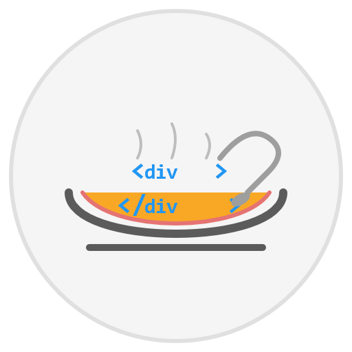

# MiniSoup HTML Parser

<p align="center">
  
</p>

A lightweight HTML parsing library for Microsoft Power Automate custom connectors, inspired by Beautiful Soup. MiniSoup enables web scraping, data extraction, and HTML analysis directly within Power Automate flows without requiring external services.

## Overview

MiniSoup provides a suite of HTML parsing capabilities optimized for the constraints of Power Automate custom connectors. It enables business users to extract structured data from websites, monitor changes, analyze content, and automate web-based workflows.

### Key Features

- **Lightweight HTML Parsing**: Efficiently extract data from HTML content
- **CSS Selector Support**: Target specific elements using familiar CSS selector syntax
- **XPath Support**: Alternative element targeting using XPath expressions
- **Table Parsing**: Extract structured data from HTML tables
- **Element Manipulation**: Find, filter, and extract information from HTML elements
- **Web Fetching**: Built-in capability to fetch HTML from URLs

## Getting Started

### Prerequisites

- Power Automate Premium license
- Administrative access to create custom connectors

### Installation

1. Create a new custom connector in Power Automate
2. Upload the `apiDefinition.swagger.json` file from this repository
3. Copy the content of `src/MiniSoup.cs` into the custom connector's code view
4. Save and create the connector

For detailed installation instructions, see [IMPLEMENTATION.md](docs/IMPLEMENTATION.md).

## Usage Examples

### Extract Product Prices from E-commerce Sites

```
Fetch HTML from product page → Select price elements → Extract price values → Store in database
```

### Monitor News Headlines

```
Fetch HTML from news site → Select headline elements → Extract text → Post to Teams channel
```

### Analyze Competitor Data

```
Fetch HTML from competitor site → Parse product table → Compare with your data → Generate report
```

For more examples, see [USE_CASES.md](docs/USE_CASES.md).

## Architecture

MiniSoup uses a lightweight, regex-based HTML parsing approach optimized for the constraints of Power Automate custom connectors. For technical details on the design and implementation, see [ARCHITECTURE.md](docs/ARCHITECTURE.md).

## License

This project is licensed under the MIT License - see the [LICENSE](LICENSE) file for details.

## Contributing

Contributions are welcome! Please feel free to submit a Pull Request.
