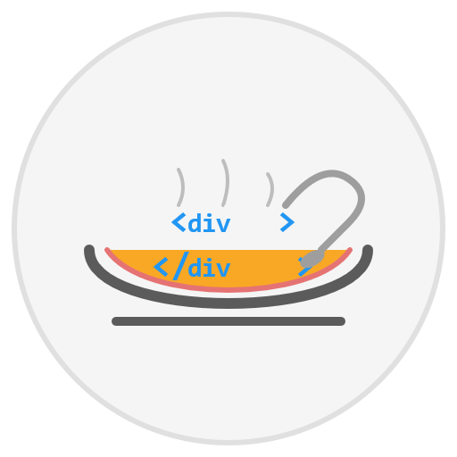

# MiniSoup HTML Parser

<p align="center">
  
</p>

MiniSoup is a lightweight HTML parsing library for Microsoft Power Automate custom connectors, inspired by Beautiful Soup. It enables web scraping, data extraction, and HTML analysis directly within Power Automate flows without requiring external services.

## Overview

MiniSoup provides a suite of HTML parsing capabilities optimized for the constraints of Power Automate custom connectors. It empowers business users to:

* Extract structured data from websites
* Monitor changes in web content
* Analyze HTML structure and content
* Automate web-based workflows

## Key Features

- **Lightweight HTML Parsing**: Efficiently extract data from HTML content
- **CSS Selector Support**: Target specific elements using familiar CSS selector syntax
- **XPath Support**: Alternative element targeting using XPath expressions
- **Table Parsing**: Extract structured data from HTML tables
- **Element Manipulation**: Find, filter, and extract information from HTML elements
- **Web Fetching**: Built-in capability to fetch HTML from URLs

## Quick Links

<div class="grid-container">
  <div class="grid-item">
    <h3><a href="getting-started">Getting Started</a></h3>
    <p>Installation and basic usage instructions</p>
  </div>
  <div class="grid-item">
    <h3><a href="operations/">Operations</a></h3>
    <p>Detailed information about MiniSoup operations</p>
  </div>
  <div class="grid-item">
    <h3><a href="use-cases/">Use Cases</a></h3>
    <p>Real-world business applications</p>
  </div>
  <div class="grid-item">
    <h3><a href="technical/">Technical Docs</a></h3>
    <p>Architecture and implementation details</p>
  </div>
  <div class="grid-item">
    <h3><a href="examples/">Examples</a></h3>
    <p>Flow examples and code samples</p>
  </div>
</div>

## Sample Usage

```
# Extract Product Prices from E-commerce Sites
Fetch HTML from product page → Select price elements → Extract price values → Store in database

# Monitor News Headlines
Fetch HTML from news site → Select headline elements → Extract text → Post to Teams channel

# Analyze Competitor Data
Fetch HTML from competitor site → Parse product table → Compare with your data → Generate report
```

## Why MiniSoup?

In the Microsoft Power Automate environment, options for HTML parsing are limited. MiniSoup addresses this gap by providing:

1. **Fully Integrated Solution**: Works directly within Power Automate without external dependencies
2. **Optimized Performance**: Designed specifically for the constraints of custom connectors
3. **Business-User Friendly**: Easy to use without deep technical knowledge
4. **Comprehensive Capabilities**: From simple extraction to complex table parsing

## License

This project is licensed under the MIT License - see the [LICENSE](https://github.com/DEmodoriGatsuO/minisoup/blob/main/LICENSE) file for details.

<style>
.grid-container {
  display: grid;
  grid-template-columns: repeat(auto-fit, minmax(250px, 1fr));
  gap: 20px;
  margin: 30px 0;
}
.grid-item {
  background-color: #f5f5f5;
  border-radius: 5px;
  padding: 20px;
  text-align: center;
}
.grid-item h3 {
  margin-top: 0;
}
</style>